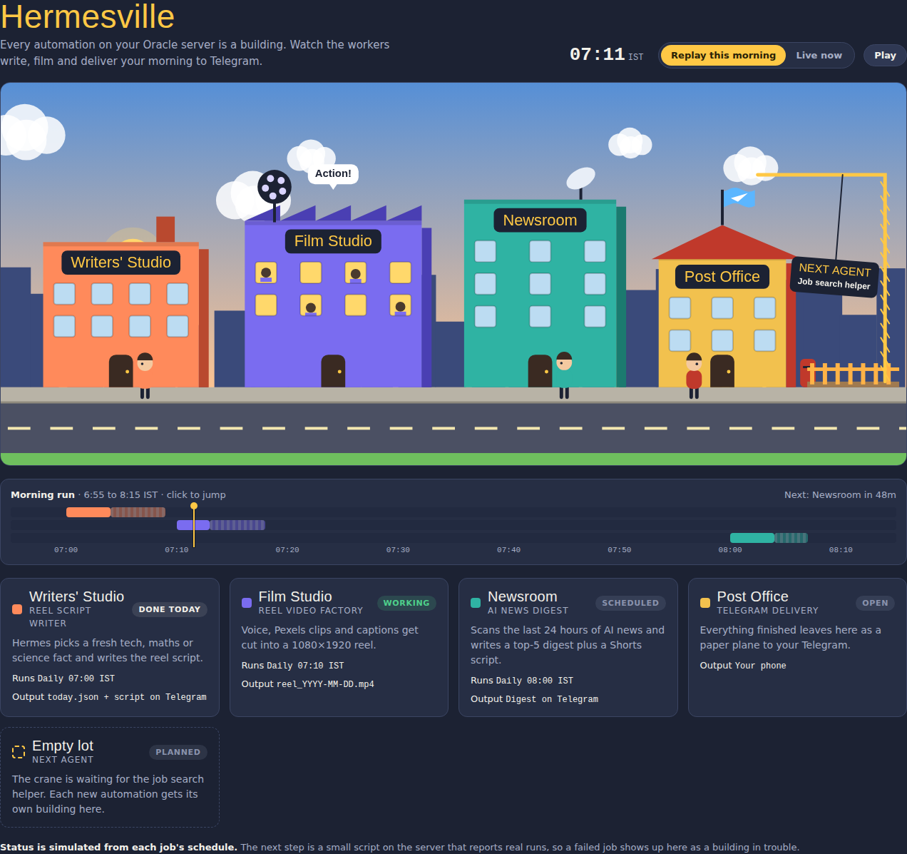

# Hermesville

A cartoon town where my AI agents live and work. Every automation I run with [Hermes Agent](https://hermes-agent.nousresearch.com/) on an Oracle Cloud free-tier server gets its own building, and the workers act out what the agent is doing: writing, filming, reporting the news, and flying finished work to Telegram as paper planes.



## The town

| Building | Agent | Runs (IST) | What it does |
|---|---|---|---|
| Writers' Studio | Reel script writer | Daily 07:00 | Picks a fresh tech, maths or science fact and writes an Instagram Reel script |
| Film Studio | Reel video factory | Daily 07:10 | Turns the script into a 1080×1920 video with voiceover, stock footage and captions |
| Newsroom | AI news digest | Daily 08:00 | Scans the last 24 hours of AI news and writes a top-5 digest plus a Shorts script |
| Post Office | Telegram delivery | Always open | Sends everything finished to my phone |
| Empty lot | Next agent | Planned | A crane waits for the job search helper |

## How the morning works

```
07:00  Hermes (cron)  ──► writes script ──► ~/reels/today.json
07:10  make_reel.py   ──► edge-tts voice + Pexels clips + captions ──► ffmpeg ──► reel.mp4
                      ──► Telegram Bot API ──► my phone
08:00  Hermes (cron)  ──► web search ──► AI news digest ──► Telegram
```

## Run the town

The page is a single HTML file with no build step.

- **Locally:** open `index.html` in a browser.
- **GitHub Pages:** Settings → Pages → Deploy from branch → `main` / root. The town is then live at `https://<username>.github.io/hermesville/`.

**Replay this morning** plays 06:55 to 08:15 in about a minute. **Live now** follows the real IST clock, with day and night in the sky. Click the timeline to jump to any moment.

## Phone app

Hermesville installs as an app from GitHub Pages. It has a home-screen icon, opens full screen, and updates itself on every push.

- **Android (Chrome):** open the Pages link, then tap ⋮ → **Install app**.
- **iPhone (Safari):** open the link, then tap Share → **Add to Home Screen**.

## Live status

The server writes `status.json` to this repo after each job using `server/report_status.py`. The app reads it every minute and whenever you open it. When a job fails, its building fills with smoke and its card turns red. With no report for today, the app falls back to the schedule simulation.

```
python3 ~/hermesville/report_status.py film running
python3 ~/hermesville/report_status.py film done "reel sent"
python3 ~/hermesville/report_status.py news failed "search quota hit"
```

`server/install_reporter.sh` installs the script and wires it into the reel video service. The GitHub token lives only in `~/.hermes/.env` on the server.

## Command center

Next to the city there's a green field terminal. Pick an agent, or tap its building, and message it directly. Each agent keeps its own thread. While Hermes is working on your request, that building lights up in the city.

It talks to the [Hermes API server](https://hermes-agent.nousresearch.com/docs/user-guide/features/api-server) (`/v1/chat/completions`) through a Tailscale Funnel URL. To set it up on the server:

```
bash server/enable_command_center.sh https://<username>.github.io
```

Then tap **POWER** in the app and enter the URL and key the script prints. The key is stored only on that device.

## My Tracking

The **My Tracking** screen shows your Google Calendar (today, tomorrow or 7 days, with what's next) and a Notion database of notes and tasks. You can tick tasks off, add new ones, and send the day to Hermes to plan.

`server/tracker.py` runs on the server (standard-library Python). It reads the calendar's secret iCal address and the Notion API, and serves them at `<funnel address>/tracking`, protected by the same API key as the command center. Neither the calendar address nor the Notion token ever leaves the server.

```
# in ~/.hermes/.env
GCAL_ICS_URL=https://calendar.google.com/calendar/ical/.../basic.ics
NOTION_TOKEN=ntn_...
NOTION_DB_ID=<32-character database id>

bash server/enable_tracking.sh
```

## The reel video factory

`automations/reel-video/` holds the pipeline behind the Film Studio.

| File | Purpose |
|---|---|
| `make_reel.py` | Reads the day's script JSON, generates the voice (edge-tts), downloads matching stock clips (Pexels API), draws captions, cuts the vertical video with ffmpeg and sends it to Telegram |
| `setup.sh` | One-shot installer for Oracle Linux (ARM or x86): Python venv, static ffmpeg, fonts and a systemd timer at 07:10 |

Secrets are read from `~/.hermes/.env` on the server and are never stored in this repo:

```
TELEGRAM_BOT_TOKEN=...
TELEGRAM_ALLOWED_USERS=...
PEXELS_API_KEY=...
```

## Stack

- **Agent:** Hermes Agent by Nous Research, using Claude Sonnet 5
- **Server:** Oracle Cloud Always Free, Ampere A1 (ARM), Oracle Linux
- **Video:** edge-tts, Pexels API, Pillow, ffmpeg
- **Delivery:** Telegram Bot API
- **Town:** plain HTML, CSS and Canvas 2D, with no framework

## Roadmap

- [x] Live status: the server reports each run, so a failed job shows smoke over its building
- [x] Installable phone app (PWA)
- [ ] Job search helper moves into the empty lot
- [ ] Better voice and word-by-word animated captions for the reels
- [ ] Night shift: workers go home and lights switch off after the last job
- [x] Command center: tap a building to message that agent
- [ ] Click a building to see its last output

## License

MIT, see [LICENSE](LICENSE).
